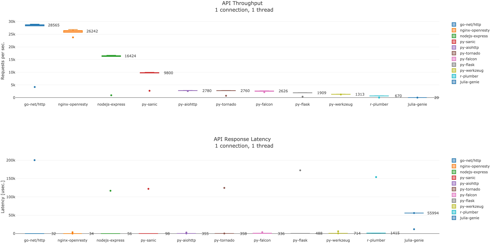

# Web-servers benchmark

Benchmarking webservers built using different languages and libraries

```yaml
python:
  - version: 3.7.4
  - libs:
    - aiohttp: 3.5.4
    - sanic: 19.6.3
    - tornado: 6.0.3
    - flask: 1.1.1
    - falcon: 2.0.0
    - werkzeug: 0.15.5
    - gunicorn: 19.9.0
go: 
  - version: 1.12.7
  - libs: 
    - net/nttp: 
nodejs:
  - version: 12.9.1
  - libs: 
    - express: ^4.17.1
r:
  - version: 3.6.1
  - libs:
    - plumber: 0.4.6
julia:
  - version: 1.1.1
  - libs:
    - Genie: 0.15.0
nginx:
  - version: openresty/1.15.8.1
```

# Benchmarking tools

<a href="https://github.com/wg/wrk/" target="_blank">wrk</a>

## Hardware/Enviroment

Tests were performed on a GCP <em>g1-small</em> machine, configs:

```yaml
instance:
  - type: g1-small
  - os-image: debian-cloud/debian-9-stretch-v20190813
  - cpu: Intel(R) Xeon(R) CPU @ 2.00GHz
  - ram: 1.7G
```

# Test

## Procedure

1. Spinup a VM

2. Install benchmark tool, configure git and clone this repo:

```bash
sudo echo 'deb http://ftp.de.debian.org/debian sid main' >> /etc/apt/sources.list
sudo apt-get update && sudo apt-get -y upgrade
sudo apt-get install -y git build-essential libssl-dev
git config --global user.name YOU_GIT_NAME YOU_GIT_FAMILYNAME
git config --global user.email YOU_GIT@EMAIL.com
git clone https://github.com/wg/wrk.git wrk
cd wrk
make
sudo cp wrk /usr/local/bin
cd ../
rm -rf wrk
git clone https://github.com/wg/wrk.git wrk
git clone https://github.com/kislerdm/web-server-benchmark.git web-server-benchmark
cd web-server-benchmark
```

3. Install required software, e.g. golang:

```bash
sudo apt-get install golang
wget https://dl.google.com/go/go1.12.7.linux-amd64.tar.gz
tar -xvf go1.12.7.linux-amd64.tar.gz,
sudo mv go /usr/local,
export GOROOT=/usr/local/go
export GOPATH=$HOME/web-server-benchmark/
echo 'PATH=$GOPATH/bin:$GOROOT/bin:$PATH' >> ~/.profile
```  

4. Launch the web server for benchmarking, e.g.:

```bash
cd web-server-benchmark/example/hello-world/go/net-http
go build -o run_server api.go
./run_server &
```

5. Launch the benchmark

```bash
cd web-server-benchmark/benchmark
export RESULTS_WRK=${PWD}/results/hello-world/gcp/g1-small/raw/go-net-http.txt
sh wrk_benchmark.sh ${RESULTS_WRK}
```

6. Commit the benchmarck results to this repo
   
```bash
git checkout -b results-golang-g-small
git add ${RESULTS_WRK}
git commit -m 'add wrk result for golang-g-small'
git push origin results-golang-g-small
```

7. Open pull request
8. Repeat the steps


## Hello World!

## API json contract

The API response is expected as:

```json
{"data": "Hello World!"}
```

## Result



# Contribution

Feel free to add more benchmark tests and open a pull request